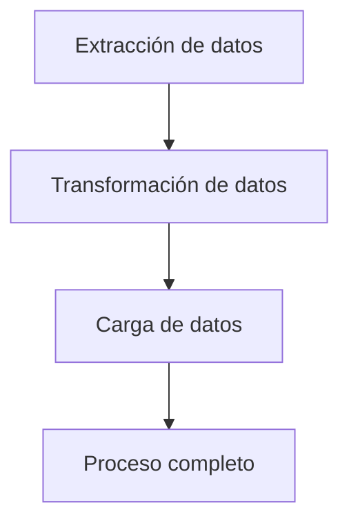
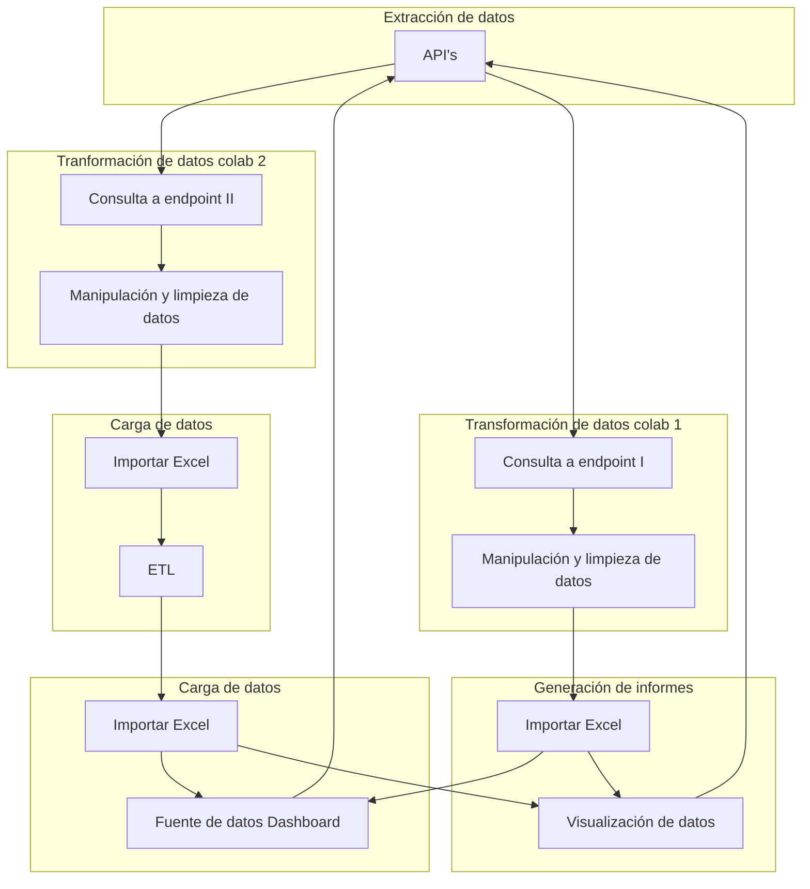

# Reporte de avances para usuarias con membresía de learning paths
Link: [GitHub](https://github.com/DaliaEmpower/DataETLMemberships.git)

Autor(es): Carlos Giles

Asesora organizacional: Fernanda Ochoa

Status: en espera de revisión.

Last Updated: 16-04-2024

## Contenido
- Goals
- Non-Goals
- Background
- Overview
- Detailed Desing
    - Solución
        - Excel
        - Dashboard
- Consideraciones
- Métricas

## Links
- [Repositorio](https://github.com/DaliaEmpower/DataETLMemberships.git)
- [DaliaEmpower](daliaempower.com)
- [ETL para usuarias con cursos y suscripciones](https://colab.research.google.com/drive/1zfStmdcw_9Ou_7BobL9O-o03222sAbQr?usp=drive_link)
- [ETL Usuarias con cursos completados](https://colab.research.google.com/drive/1MuTQ32KM6swGd4hW9pZ4an6SbwkWdT2V?usp=drive_link)
- [Diseño, ETL y Reporte](https://colab.research.google.com/drive/1zfStmdcw_9Ou_7BobL9O-o03222sAbQr?usp=drive_link)

## Objetivos
Mostrar el comportamiento de las usuarias con suscripción a una membresía de DaliaEmpower, mediante reportes en excel/Power BI y/o sitio web.

## Goals
- Reporte visual del avance de usuarios con una determinada suscripción.
- Reporte estadístico de usuarios con una determinada suscripción.
## Non-Goals
- Reportes individuales (por usuario)
- Actualización inmediata

## Background
Como proveedores de una plataforma de formación (por membresía) con clientes B2C y B2B, no contamos con una visualización de avances y estadísticas de los y las usuarias que se suscriben a la membresía. Los clientes B2B requieren de una herramienta que les ayude a conocer el aprovechamiento.

_Pendiente definir si agrego acá otros design docs_

## Overview
### Reporte excel
Necesitamos manejar 2 API's principales:
1. https://apix.daliaempower.com/datos/suscripciones/ejemplo
- Nos brinda información de todas y cada una de las usuarias registradas en la plataforma, con o sin cursos y suscripciones.
- Los datos que muestra son:

|_id     | email         | firstName|lastName|courses|subscriptions|lastLogin|
|--------|---------------|----------|--------|-------|-------------|---------|
|09232034|user@domain.com|fName     |lName   |course |{'membershipId': '6406a87e71c5c9237bf67116', 'status': 'active', 'startDate': '2024-02-13T16:40:18.671Z'}|2024-02-13T16:40:10.122Z|

- Para el proceso de transformación necesitamos 2 conjuntos de datos que nos permita manejar los registros por identificador, [datasetCourses](https://drive.google.com/file/d/1sHXNmBqZMq7s_PItUW332L5m-vGIRlHj/view?usp=drive_link) y [datasetMembreships](https://drive.google.com/file/d/1I5Cq7LCLV0ganTgEHOmSyOsDsW0wu68A/view?usp=drive_link).

2. https://api.daliaempower.com/ultima/vista/ejemplo
- Brinda información sobre la última **lección** vista del usuario y si está terminada.
- Los datos son:

|_id   |lessonID|userID|__V|courseID|createdAt               |updatedAt               |lessonName|isCompleted|
|------|--------|------|---|--------|------------------------|------------------------|----------|-----------|
|64e426|64065cw3|64065c|0  |64065c0b|2023-08-22T03:06:20.938Z|2023-09-15T07:56:02.004Z|b484bfg     |false      |

Estas API's serán utilizadas para obtener un **DataFrame** que brinde información legible, explícita y valiosa de las usuarias (ID, Email, First Name,	Last Name,	Membership Names, Last Login Date, Last Login Hour,	ID Course, Course, Course Type, Courses Count, Status, Category, Level,	Instructor, lessonID, lessonName, isCompleted, Fecha primer ingreso, Hora primer ingreso, Fecha ultimo ingreso y Hora ultimo ingreso) que será guardada en un **CSV** llamado **dataCourses**, el cual será utilizado en posteriores procesos **ETL** con objetivos específicos y usuarios determinados.

Para conocer los cursos que ha completado cada usuario tenemos una tercera API:

3. https://api.daliaempower.com/cursos/completos/ejemplos
- Los datos que muestra:
 
|_id    |	courseID|	userID|	createdAt|	updatedAt|	__v|
|-------|-----------|---------|----------|-----------|-----|
|647049b|64065c0b4	|64065c0f4|2023-05-26T05:55:04.169Z|2023-05-26T05:55:04.169Z|0|

- Por medio de **ETL** y con conjuntos de datos para cursos y usuarios especificos debemos obtener **DataFranes/Tablas** con registros por cursos (donde se repetirán las usuarias) o con registros por usuarios (donde los cursos completados se listen en un solo registro) según las necesidades.
### Sitio web
Con los reportes generados por **ETL** cargamos objetos gráficos y layouts en **Python** con las librerías *pandas, plotly y dash* para presentar la información dentro de una estructura **html**.

## Detailed desing

Para el desarrollo de los reportes con excel y del dashboard web, será necesario implimentar un proceso de ***Extración, Transformación y Carga*** (**ETL**) de datos. En general el proceso anterior es:

Un diagrama más detallado de este proyecto en particular:

El proceso anterior se hace con lenguaje de programación **Paython** utilizando las librerías:
* [Pandas](https://pandas.pydata.org/)
* [Plotly](https://plotly.com/python/)
* [Dash](https://dash.plotly.com/tutorial?_gl=1*1xm7dhg*_ga*NzEwNzY3NjQ5LjE3MDU5NjMxMjc.*_ga_6G7EE0JNSC*MTcwODEwMDE1MC41LjEuMTcwODEwMDE4NC4yNi4wLjA.)

El flujo de trabajo se divide en 3 etapas, una por cada notebook, pero se pretende tener un solo notebook cuando el proceso esté lo suficientemente pulido.

**Nuevas funciones/herramientas**

- Este proyecto brinda dos nuevas opciones de compartir los avances y estádisticas de usuarias de la plataforma con una membresía específica; formato excel y dashboard web.

- Estos nuevos componentes (**scripts y reportes**) otorgan la posibilidad de presentar claramente y eficazmente el comportamiento de los usuarios.

- El código es reutilizable, de hecho, al traterse de scripts se ejecuta una y otra vez.

- Los mismos resultados del **ETL** se utilizan para excel y web.
